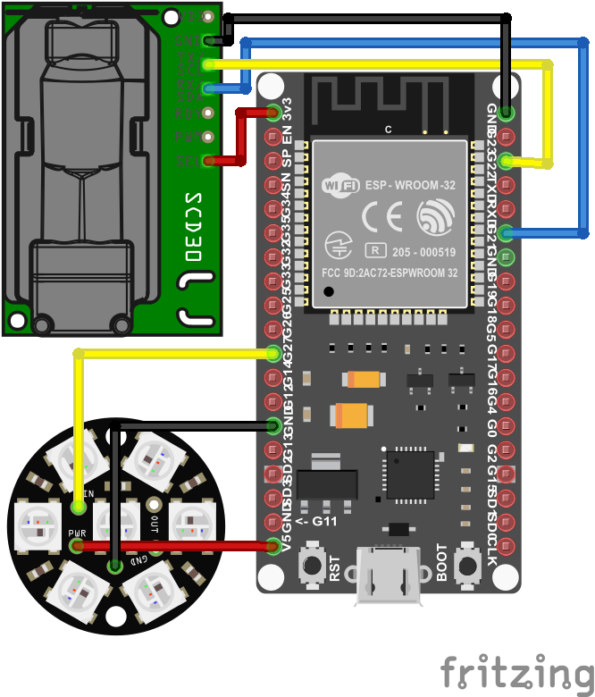

# Christmas ball

Dancing around the christmas tree, unwrapping presents and having a good time together with the family can lead to a lack of time perception. Over time the level of CO2 will accumulate to a level that can cause headache, which is a horrible way to end christmas night. This christmas ball will show when the level of CO2 is above a given threshold. I decided to have a threshold of 2000 ppm, but according to [dhs.wisconsin.gov](https://www.dhs.wisconsin.gov/chemical/carbondioxide.htm#:~:text=400%E2%80%931%2C000%20ppm%3A%20typical%20level,stagnant%2C%20stale%2C%20stuffy%20air) a level below 1000 is to be prefered.


## Step by step

### 1. Components

The project uses the following components:

1. ESP32-wroom-32E development board
2. [SCD30 sensor](https://www.sensirion.com/en/environmental-sensors/carbon-dioxide-sensors/carbon-dioxide-sensors-scd30/)
3. NeoPixel Jewel LED module
4. Battery
5. Cables

### 2. Putting everything together

Put everything together as shown in the image. The ESP32 pin connection to the SCD30 sensor is as follows:

- GPIO21 > SDA
- GPIO22 > SCL
- 3.3V > 3V
- GND > GND

NeoPixel Jewel

- GPIO27 > Data input
- GND > GND
- 5V > 5V DC



### 3. Running the program

I used Jaguar from Toit as it is really fast for developing in a non test-driven prototyping environment. It offers hotreload in a second, with the watch command.

Read more on how to set it up at [Toit Jaguar](https://github.com/toitlang/jaguar).

Afterwards:

```
jaguar watch src/main.toit
```

### 4. Enjoy christmas without a headache

I found that the level of CO2 is usually too high in my working environment and it sure increases production to let some fresh air in.
